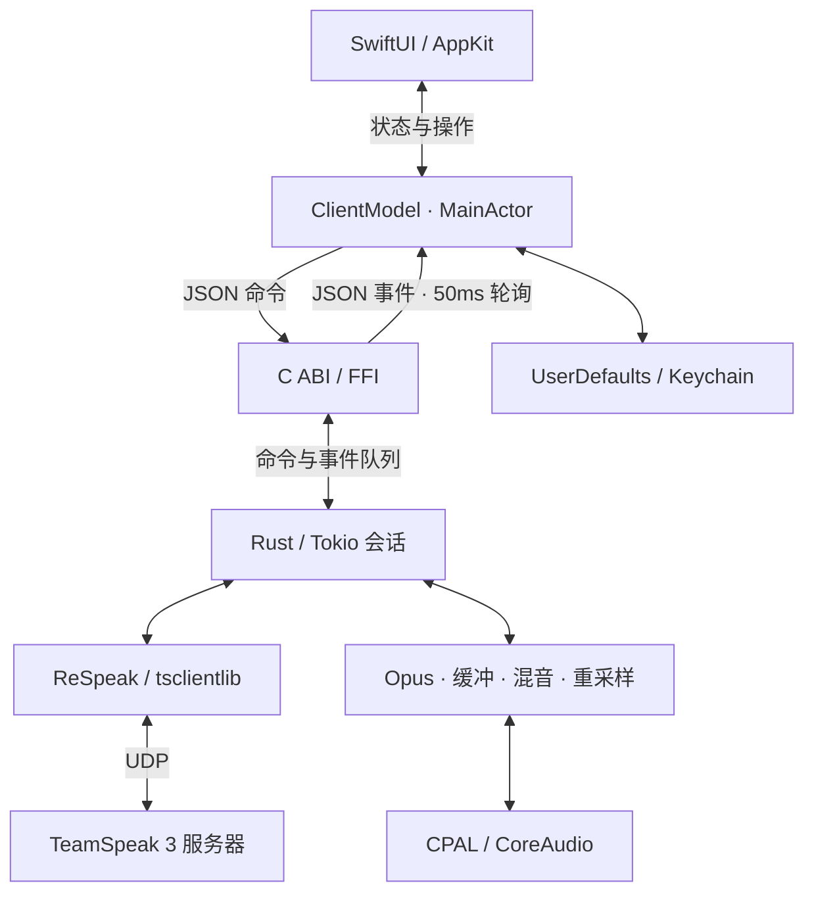
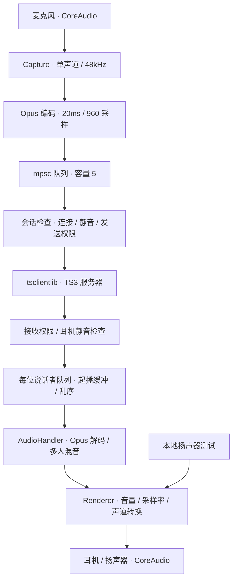

# 项目架构

[返回 README](../README.md) · [开发与贡献](../CONTRIBUTING.md)

所有组件运行在一个 macOS App 进程中，Rust 核心和 Opus 静态链接。

## 总体结构

| 模块 | 源码与职责 |
| --- | --- |
| 原生界面 | `Native/QuietSpeakApp.swift`、`MainView.swift`、`Sheets.swift`：窗口、频道、聊天、设置与菜单栏 |
| 状态与存储 | `Native/ClientModel.swift`、`Storage.swift`：MainActor 状态、权限、事件轮询；收藏存入 UserDefaults，身份和密码存入 Keychain |
| 会话与 FFI | `Core/src/lib.rs`：独立线程中的 Tokio 单线程运行时，管理命令、事件、网络、重连与发送权限 |
| 音频 | `Core/src/audio.rs`：CoreAudio 输入 / 输出回调运行 Capture 和 Renderer，PCM 数据在 Rust 内处理 |
| 聊天 | `Core/src/chat.rs`：自己的消息按发送成功确认显示，忽略重复回显，每次发送独立跟踪 |
| 协议与解码 | `Vendor/tsclientlib/`：域名发现、UDP 协议、接收队列、Opus 解码与混音 |

`qs_command` 提交 JSON 命令，`qs_poll` 返回 Rust 分配的 UTF-8 JSON 字符串，Swift 使用后调用 `qs_free_string` 释放。事件队列最多保留 512 个事件，并合并旧快照。

## 音频链路

起播缓冲目标为 60ms，播放前允许重排。迟到或重复包会丢弃，较大的正向序号跳变会重建对应说话者队列，保留其他说话者。

会话线程与输出回调用 `Arc<Mutex<AudioHandler>>` 共享接收队列，麦克风门控、音量和提示音控制使用原子变量。输入回调将编码包提交到有界队列；离线扬声器测试使用独立的短时测试线程。

图源直接保存在本文件的 Mermaid 代码块中。第三方来源和补丁见 [Vendor](../Vendor/README.md)。
