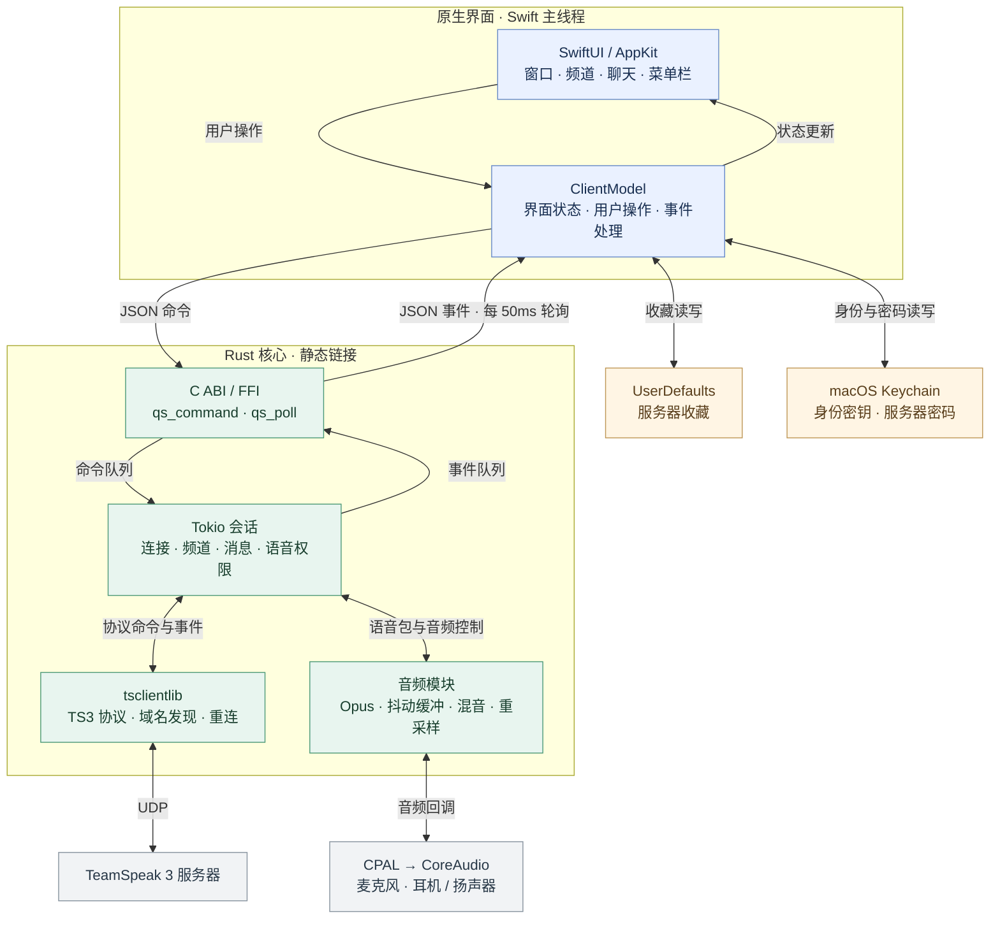
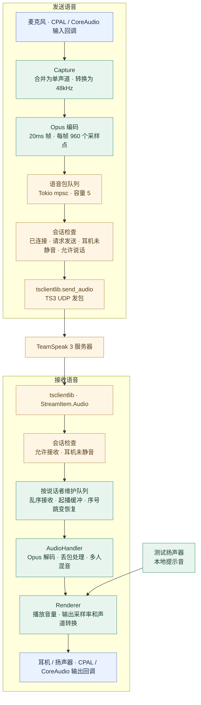

# 项目架构

[返回项目介绍](../README.md) · [开发路线](ROADMAP.md)

以下图示对应当前 0.1.7 源码。整个客户端运行在一个 macOS App 进程内，Rust 核心和 Opus 静态链接到 App。

Swift 的 `ClientModel` 管理界面状态，把连接、加入频道、聊天和音频控制序列化为 JSON 命令。Rust 通过命令队列接收操作，把频道快照、消息、连接状态和音频错误放入事件队列；Swift 每 50ms 轮询并更新界面。

语音 PCM 在 Rust 音频模块内处理。网络语音包经 Opus 编解码、播放队列和重采样，通过 CPAL 调用 CoreAudio 与实际音频设备交换数据。

### 音频数据流

起播以 60ms 为初始缓冲目标，允许 UDP 包在播放前重新排序；已播放的迟到包和重复包会被丢弃，较大的正向序号跳变会重建对应说话者的队列。本地扬声器测试经过同一个 Renderer 输出。

### 代码职责和线程

| 模块 | 源码 | 职责与执行位置 |
| --- | --- | --- |
| 界面 | `Native/QuietSpeakApp.swift`、`MainView.swift`、`Sheets.swift` | SwiftUI 窗口、表单、菜单栏和 App 生命周期 |
| 状态管理 | `Native/ClientModel.swift` | MainActor；界面状态、操作校验、事件轮询和麦克风权限 |
| 本地存储 | `Native/Storage.swift`、`ClientModel.swift` | Keychain 身份/密码；UserDefaults 收藏；地址校验和频道排序 |
| FFI 桥接 | `Core/src/lib.rs` | `qs_initialize`、`qs_command`、`qs_poll`、`qs_free_string`；命令与事件的跨语言所有权 |
| 网络会话 | `Core/src/lib.rs` 的 `session` | 独立协议线程内的 Tokio 单线程运行时；处理命令、网络事件、语音发送和连接超时 |
| 音频 | `Core/src/audio.rs` | 会话线程接收语音包；CoreAudio 输入/输出回调运行 Capture 和 Renderer |
| TS3 协议与接收解码 | `Vendor/tsclientlib/` | 服务器发现、UDP、协议状态、每位说话者的 AudioHandler 队列、解码与混音 |

会话线程和输出回调用 `Arc<Mutex<AudioHandler>>` 共享接收队列；麦克风门控、音量和本地提示音等控制使用原子变量。输入回调通过容量为 5 的 `mpsc` 队列提交已编码语音包。离线扬声器测试会短暂创建单独的本地测试线程。

自己的频道消息按发送操作的成功确认显示，忽略服务器对自己频道消息的回显；每次发送独立跟踪，因此相同文字可以连续发送。其他成员的消息通过服务器通知显示。

事件队列最多保留 512 个事件，并合并被新快照替代的旧快照。`qs_poll` 返回 Rust 分配的 UTF-8 JSON 字符串，Swift 使用后调用 `qs_free_string` 释放。

可编辑图源：[总体架构](architecture.mmd) · [音频链路](audio-flow.mmd)。

