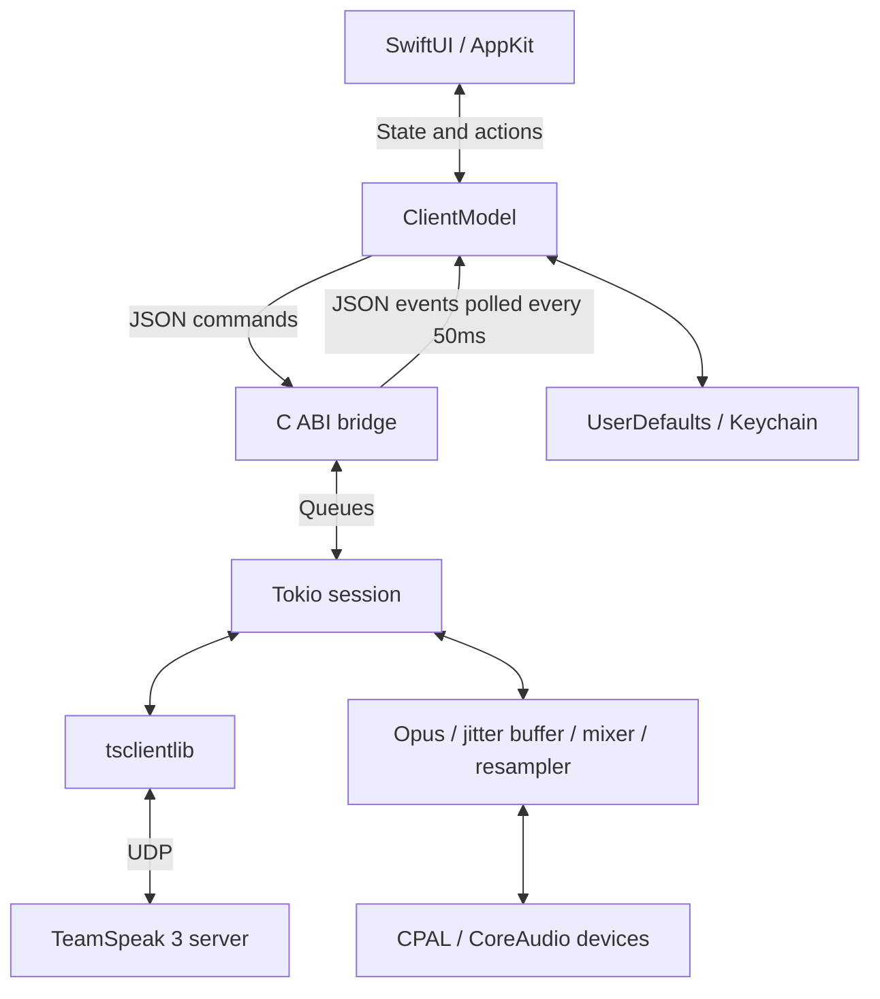

# QuietSpeak

A compact native macOS TeamSpeak 3 client, built with SwiftUI and Rust. **0.1.5 development preview**. The current UI is in Simplified Chinese.

[中文](README.md) · [MIT license](LICENSE) · [Contributing](CONTRIBUTING.md) · [Changelog](CHANGELOG.md) · [Roadmap](Docs/ROADMAP.md)

QuietSpeak uses [ReSpeak/tsclientlib](https://github.com/ReSpeak/tsclientlib) for the TS3 protocol, CPAL for audio devices and Opus for audio coding. The native UI, application behavior, Swift/Rust bridge and device audio pipeline are implemented by QuietSpeak. Vendored sources retain their original licenses; see [Vendor documentation](Vendor/README.md).

[GitHub](https://github.com/Green-hats/QuietSpeak) · [Build status](https://github.com/Green-hats/QuietSpeak/actions) · [Issues](https://github.com/Green-hats/QuietSpeak/issues)

Source is public; installer Releases remain drafts. Build locally using the instructions below.

## Interface


Content view rendered with fixture data. [Dark appearance](Docs/screenshots/quietspeak-dark.png).

The two top-left buttons independently toggle the server and channel sidebars. Visibility persists across restarts; native dividers resize the panes. Green backgrounds distinguish the sidebars from the system content background in both appearances.

The home logo is centered in the content pane. [Light home](Docs/screenshots/quietspeak-home-light.png) · [Dark home](Docs/screenshots/quietspeak-home-dark.png).

## Features

- Green native SwiftUI/AppKit interface with independently collapsible, resizable sidebars, channel tree, member list and channel chat.
- Server bookmarks, SRV/TSDNS discovery, persistent identity and reconnection.
- OpusVoice/OpusMusic audio, mixing, resampling and startup jitter buffering.
- Foreground push-to-talk, continuous microphone mode, mute, deafen and volume.
- Menu bar controls, local speaker test and output device name.
- UserDefaults bookmarks and macOS Keychain identity/password storage.

## Run

The local prebuilt App is `dist/QuietSpeak.app`. Apple Silicon is locally validated and requires macOS 14 or later. Runtime dependencies are linked into the App; end users do not need Rust or Homebrew.

```bash
open dist/QuietSpeak.app
```

Add your server address, nickname and optional password, then join a channel. Fresh installations start with no private server bookmarks. Existing saved bookmarks and identities are preserved.

The microphone starts disabled. Enable it and grant the macOS microphone permission when prompted. Default push-to-talk uses the button or Option key while the App is in the foreground. Use continuous mode when another App is foreground. Changing channels disables the microphone; deafen also stops microphone transmission.

Closing the window keeps the menu bar controls available. Use Quit to exit.

## Build and test

Requires macOS, Xcode Command Line Tools including `swift-format`, Rust, CMake and Python 3.9+. Rust 1.95.0 and required components are pinned in `rust-toolchain.toml`. Initial builds download the toolchain and Cargo dependencies.

Vendored protocol and Opus sources are included in an ordinary clone or source archive; no submodule initialization is needed.

```bash
./check.sh
./test.sh
./build.sh
python3 Scripts/package-release.py
```

- `check.sh`: Rust formatting, Clippy, Swift formatting, shell syntax and version consistency.
- `test.sh`: Rust unit tests and Swift model checks, without microphone capture or automatic public-server connections.
- `build.sh`: locked release build, generated notices, static linking, app icon, ad-hoc signing and bundle verification.
- `package-release.py`: verified App/source archives and SHA-256 files in `dist/releases/`.

Build caches default to `work/build/`; the App defaults to `dist/QuietSpeak.app`. Paths can be changed with `QUIETSPEAK_BUILD_DIR`, `QUIETSPEAK_APP_PATH`, `CARGO_HOME` and `CARGO_TARGET_DIR`.

The optional read-only smoke example accepts an explicitly supplied test server and remains input-muted:

```bash
MACOSX_DEPLOYMENT_TARGET=14.0 OPUS_STATIC=1 OPUS_NO_PKG=1 \
  cargo run --manifest-path Core/Cargo.toml --release --locked --example smoke -- 127.0.0.1:9987
```

## Architecture



All components run in one App process. Swift manages UI state on MainActor; a dedicated Rust thread runs a single-threaded Tokio runtime. Device callbacks execute the Capture and Renderer audio code. Audio PCM stays within the Rust audio pipeline. See the Chinese README and editable [overview](Docs/architecture.mmd) / [audio flow](Docs/audio-flow.mmd) for details.

## Status and limitations

The local Apple Silicon build and tests are validated. CI is configured for arm64 (`macos-15`) and x86_64 (`macos-15-intel`), see [Actions](https://github.com/Green-hats/QuietSpeak/actions) for build results. Intel device behavior still requires manual validation.

Supported voice codecs are OpusVoice and OpusMusic. Global push-to-talk, echo cancellation, voice activation, private-message sending, file transfer, permission management and identity import are not implemented. Audio uses the system default devices; reconnect after a device change if audio stops.

The App uses ad-hoc signing and is not notarized. Manual two-endpoint audio, Bluetooth and additional macOS version checks remain necessary. Validation records are in `VALIDATION.txt`.

## Contribute and release

Read [CONTRIBUTING](CONTRIBUTING.md), [CODE_OF_CONDUCT](CODE_OF_CONDUCT.md), [SECURITY](SECURITY.md) and the [release guide](Docs/RELEASING.md). Version tags trigger dual-architecture builds and prepare a GitHub Release draft for maintainer review.

## Licensing and attribution

QuietSpeak project code is MIT licensed. Third-party sources keep their original licenses, including MIT/Apache-2.0 for tsclientlib, ISC for audiopus_sys and the bundled Opus license. See `THIRD_PARTY_NOTICES.txt`, [dependency inventory](Docs/DEPENDENCIES.json) and [vendor provenance](Vendor/PROVENANCE.json).

QuietSpeak is independent of TeamSpeak Systems GmbH and is not an official TeamSpeak product.
