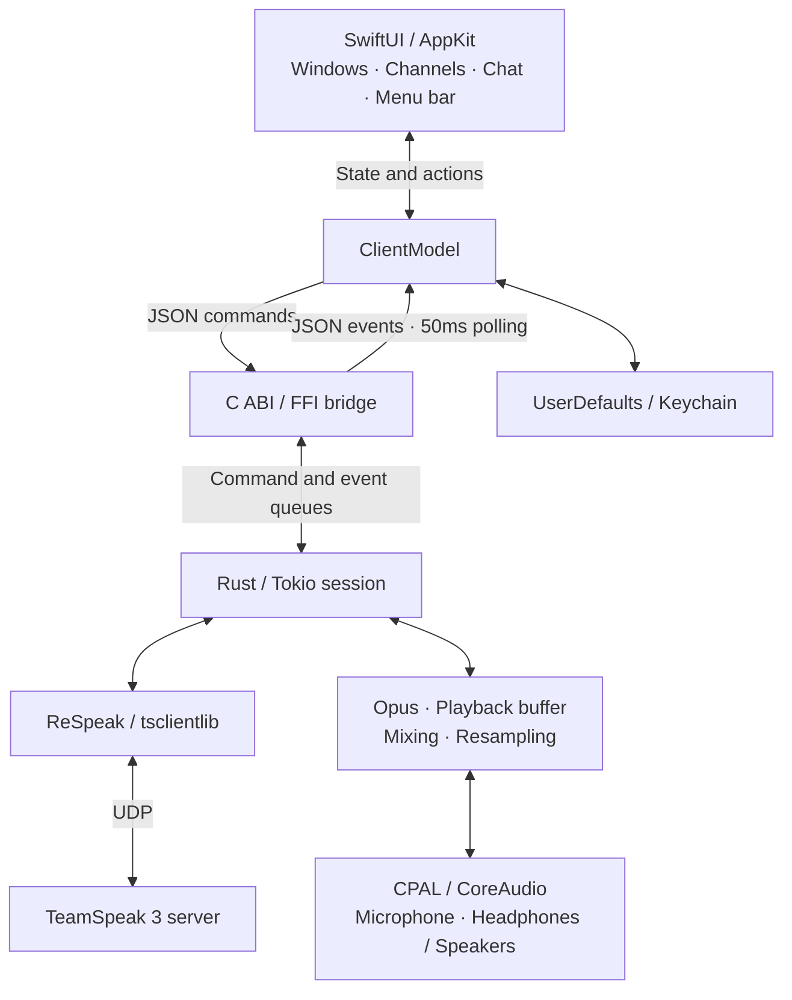

<div align="center">


# QuietSpeak

**Native macOS · TeamSpeak 3 · Lightweight voice chat**

Connect to your TeamSpeak 3 server, browse channels, talk and send messages in a native three-pane interface.

[](#quick-start) [](Native/) [](Core/) [](LICENSE) [](CHANGELOG.md) [](https://github.com/Green-hats/QuietSpeak/actions/workflows/ci.yml)

[简体中文](README.md) · [**English**](README.en.md)

[Quick start](#quick-start) · [Features](#features) · [Architecture](#architecture) · [Documentation](#documentation) · [Issues](https://github.com/Green-hats/QuietSpeak/issues)

</div>

---

## Screenshots


Captured from native macOS windows using fictional servers, members and messages.


## Features

| Capability | Details |
| --- | --- |
| Native interface | SwiftUI / AppKit, system toolbar and collapsible, resizable sidebars |
| System materials | White with green accents, dark appearance, Liquid Glass on macOS 26+ and Material on older systems |
| Server connection | Direct TS3 connection, SRV / TSDNS discovery, persistent identity and automatic reconnection |
| Channels | Channel tree, password-protected channels, visible members and server bookmarks |
| Voice | OpusVoice / OpusMusic, multiple-speaker mixing, playback buffering and resampling |
| Audio controls | Microphone mute, deafen, push-to-talk / continuous mode, output volume and local speaker test |
| Messages | Send and receive channel messages; receive server messages and private messages |
| macOS integration | Menu bar controls, UserDefaults bookmarks and login Keychain storage for identity keys and remembered passwords |

Current version: **0.1.7 development preview**. The UI is in Simplified Chinese. Source is public; installer Releases remain drafts. Build locally to try the App.

## Quick start

### Requirements

| Tool | Requirement |
| --- | --- |
| macOS | 14 or later |
| Xcode | 26+ recommended, with its Command Line Tools selected; the toolchain must include `swift-format` |
| Rust | 1.95.0 pinned in `rust-toolchain.toml`, including rustfmt / clippy |
| CMake | Builds the statically linked Opus library |
| Python | 3.9 or later |

Older Xcode toolchains can build the Material fallback without Liquid Glass APIs. Apple Silicon has been built and used locally. CI is configured for Apple Silicon and Intel; Intel hardware validation remains necessary.

### Build and run

```bash
git clone https://github.com/Green-hats/QuietSpeak.git
cd QuietSpeak

./build.sh
open dist/QuietSpeak.app
```

The first build downloads the pinned Rust toolchain and Cargo dependencies. Protocol and Opus sources are included in the repository; no submodule initialization is needed.

The script builds for your Mac's architecture, creates `dist/QuietSpeak.app`, applies ad-hoc signing and verifies the bundle. Running the App requires no Rust, Homebrew or Opus installation. Developer ID signing and notarization are not yet available.

### Start using the App

1. Add a server address, nickname and optional password, then connect and join a channel. Protected channels request their own password.
2. The microphone starts disabled. Enable it and grant macOS microphone permission.
3. Default push-to-talk uses the bottom button or `⌥ Option`. Keyboard push-to-talk works only while QuietSpeak is in the foreground; use continuous mode when working in another App.
4. Open audio settings to adjust playback volume, view the output device or run the local speaker test.

Changing channels disables the microphone. Deafen also stops voice transmission. Closing the window keeps menu bar controls available; use Quit to exit.

### Interface controls

| Action | Control |
| --- | --- |
| Show / hide servers | System toolbar sidebar button |
| Show / hide channels | View → Show Channel List, or `⌘⇧2` |
| Resize panes | Drag the system dividers |
| Connect | Top-right connection button, or `⌘K` |
| Audio settings | Top-right settings button, or `⌘,` |

Sidebar visibility persists across restarts. Voice controls span only the channel and chat workspace, follow its width and switch to a compact layout in narrow windows.

## Architecture



Swift manages UI state and user actions; Rust handles the protocol and audio. All components run in one App process. The Rust core and Opus are statically linked, and PCM audio stays in the Rust pipeline.

The TS3 protocol is based on [ReSpeak/tsclientlib](https://github.com/ReSpeak/tsclientlib). QuietSpeak implements the native UI, application behavior, Swift / Rust bridge and device audio pipeline.

| Layer | Technology |
| --- | --- |
| UI and system integration | SwiftUI · AppKit · AVFoundation |
| Network core | Rust · Tokio · ReSpeak/tsclientlib |
| Audio | CPAL / CoreAudio · Opus / audiopus |
| Language bridge | C ABI · JSON commands and events |
| Local storage | UserDefaults · macOS Keychain |
| Build and quality | Cargo · Xcode · CMake · Python · GitHub Actions |

Thread boundaries, FFI ownership and the complete audio flow are documented in [Architecture](Docs/ARCHITECTURE.md) (Chinese).

## Project layout

```text
QuietSpeak/
├── Native/                   # SwiftUI / AppKit, state, storage and shared icon
├── Core/
│   ├── src/lib.rs            # TS3 session, commands, events and FFI
│   ├── src/audio.rs          # Device audio, mixing and resampling
│   ├── src/chat.rs           # Send confirmation, echoes and regression tests
│   └── examples/smoke.rs     # Input-muted server check
├── Vendor/                   # Pinned upstream sources, licenses and patches
├── Resources/                # App configuration and microphone entitlement
├── Scripts/                  # Icons, version checks, notices and packaging
├── Tests/                    # Swift model checks
├── Docs/                     # Architecture, screenshots, roadmap and releases
├── .github/                  # Dual-architecture CI, drafts and templates
├── build.sh / check.sh / test.sh
├── dist/                     # Generated App and packages (not tracked)
└── work/                     # Build cache (not tracked)
```

## Development and validation

```bash
./check.sh                    # Formatting, Clippy, shell syntax and versions
./test.sh                     # Rust tests and Swift model checks
./build.sh                    # Build, sign and verify the App
python3 Scripts/package-release.py
```

Packaging writes App / source ZIPs and SHA-256 files to `dist/releases/`. Override build paths with `QUIETSPEAK_BUILD_DIR`, `QUIETSPEAK_APP_PATH`, `CARGO_HOME` and `CARGO_TARGET_DIR`.

15 Rust tests and Swift model checks have passed locally, covering audio frames, codecs, packet ordering, resampling, chat echoes, address validation and channel ordering. Tests do not automatically connect to public servers or capture microphone audio. Two-endpoint calls, Bluetooth, Intel hardware and additional macOS versions still need manual validation; see [Validation records](VALIDATION.txt) and [CI builds](https://github.com/Green-hats/QuietSpeak/actions).

Version tags trigger dual-architecture builds and prepare a Release draft for maintainer review. See the [release guide](Docs/RELEASING.md).

## Limitations and troubleshooting

- Voice supports OpusVoice / OpusMusic only, without Speex / CELT.
- Global push-to-talk, voice activation, echo cancellation, private-message sending, file transfer, permission management and identity import are not implemented.
- Audio uses the system default devices. Reconnect if audio stops after changing Bluetooth or other devices.

**No sound:** Check that deafen is off and volume is above zero. Run the speaker test and check the output device in System Settings → Sound.

**`No route to host`:** Check your network and proxy environment. Do not append the default port to an SRV hostname; let the client discover the server port.

## Documentation

| Document | Contents |
| --- | --- |
| [Architecture](Docs/ARCHITECTURE.md) | Threads, FFI, queues and audio flow |
| [Roadmap](Docs/ROADMAP.md) | Validation work and planned features |
| [Contributing](CONTRIBUTING.md) | Environment, checks and contribution process |
| [Release guide](Docs/RELEASING.md) | Packaging, signing and Release drafts |
| [Changelog](CHANGELOG.md) | Features and fixes by version |
| [Validation records](VALIDATION.txt) | Automated tests and hardware checks |
| [Vendor documentation](Vendor/README.md) | Pinned upstream revisions and patches |
| [Security policy](SECURITY.md) | Reporting security issues |

## Contributing

Report issues or submit PRs through [GitHub](https://github.com/Green-hats/QuietSpeak/issues). For audio issues, include macOS version, architecture, audio devices and channel codec. Read the [contributing guide](CONTRIBUTING.md) before submitting code.

## License and acknowledgements

QuietSpeak project code is licensed under [MIT](LICENSE). Third-party sources retain their own licenses.

- [ReSpeak/tsclientlib](https://github.com/ReSpeak/tsclientlib) — TeamSpeak 3 protocol and received-audio handling.
- [CPAL](https://github.com/RustAudio/cpal) — Cross-platform audio device interface.
- [Opus](https://opus-codec.org/) / [audiopus](https://github.com/Lakelezz/audiopus) — Voice codec and Rust bindings.

See [Vendor documentation](Vendor/README.md) for upstream revisions, audio queue changes and build patches; [Third-party notices](THIRD_PARTY_NOTICES.txt) and [DEPENDENCIES.json](Docs/DEPENDENCIES.json) list licenses and dependencies.

QuietSpeak is independent of TeamSpeak and is not an official TeamSpeak product.
