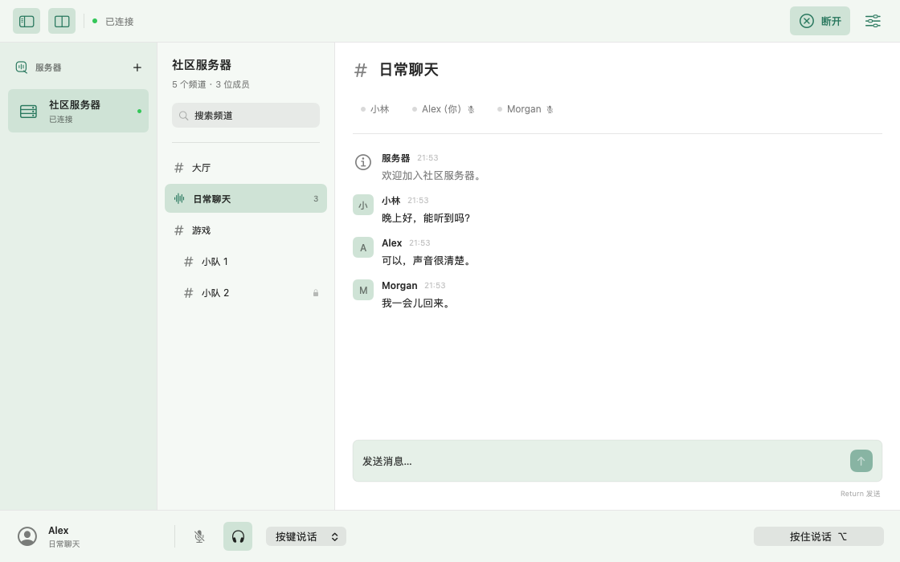
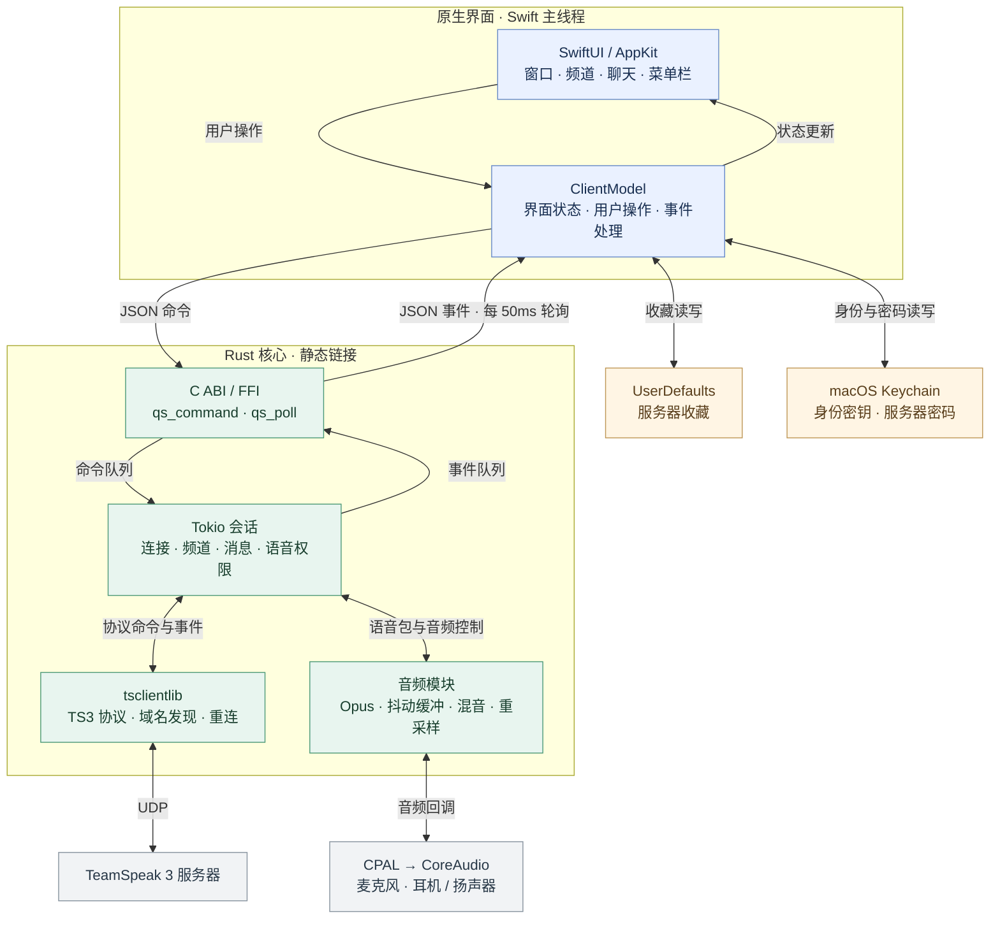
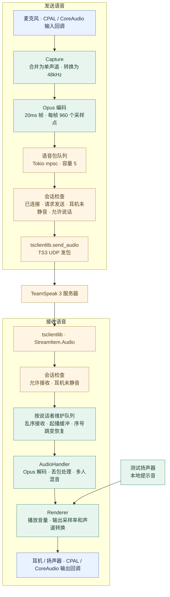

# 轻语 QuietSpeak

简洁实用的原生 macOS TeamSpeak 3 开源客户端。当前版本为 **0.1.5 开发预览**，界面为简体中文。

[English](README.en.md) · [MIT 许可证](LICENSE) · [贡献指南](CONTRIBUTING.md) · [更新记录](CHANGELOG.md) · [开发路线](Docs/ROADMAP.md)

项目基于 [ReSpeak/tsclientlib](https://github.com/ReSpeak/tsclientlib) 实现 TS3 协议，并使用 CPAL 和 Opus；原生界面、业务逻辑、Swift/Rust 桥接及音频设备处理由 QuietSpeak 实现。第三方来源和补丁见 [Vendor 说明](Vendor/README.md)。

[GitHub 仓库](https://github.com/Green-hats/QuietSpeak) · [构建状态](https://github.com/Green-hats/QuietSpeak/actions) · [问题反馈](https://github.com/Green-hats/QuietSpeak/issues)

目前公开源码，安装包 Release 保留为草稿。可以按下方步骤自行构建。

## 运行

预构建 App 位于 `dist/QuietSpeak.app`，适用于 **Apple Silicon、macOS 14 及以上**，运行时无需安装 Rust、Homebrew 或 Opus。

```bash
open dist/QuietSpeak.app
```

1. 添加服务器地址、昵称和可选密码。新安装没有预置私人服务器；已有收藏仍会保留。
2. 加入需要的频道；密码频道会要求输入频道密码。
3. 麦克风默认关闭，点击麦克风按钮开启；首次使用需要授予 macOS 麦克风权限。
4. 默认按键说话：按住底部按钮或 `⌥ Option`。键盘按键仅在轻语位于前台时生效；在其他 App 中使用可切换为持续说话。
5. 切换频道后麦克风自动关闭；耳机静音也会停止发送语音。
6. 打开语音设置调整播放音量、查看输出设备，或点击“测试扬声器”播放本地提示音。

关闭窗口后 App 仍保留菜单栏控制；选择“退出轻语”才会退出。

## 界面



使用示例数据渲染的内容区预览。[深色外观](Docs/screenshots/quietspeak-dark.png)。

左上角两个按钮分别显示或隐藏服务器栏、频道栏，退出后保留折叠状态。拖动两栏之间的分隔线可调整宽度。三栏分别使用浅绿、淡绿和系统内容背景，跟随系统切换深浅色。

首页 Logo 居中放在右侧内容区。[浅色首页](Docs/screenshots/quietspeak-home-light.png) · [深色首页](Docs/screenshots/quietspeak-home-dark.png)。

## 功能

- 绿色原生三栏界面，侧栏可独立折叠、调整宽度，适配系统深浅色模式。
- TS3 服务器连接、SRV/TSDNS 域名发现、固定身份和自动重连。
- 服务器收藏、频道树、频道搜索、密码频道和可见成员列表。
- 频道文字消息收发，接收服务器消息和私信。
- Opus 语音收发、多人混音、重采样和播放缓冲。
- 麦克风关闭、耳机静音、按键/持续说话、输出音量和菜单栏控制。
- 身份密钥和记住的服务器密码保存在 macOS 登录钥匙串。

## 技术栈

| 层 | 技术与职责 |
| --- | --- |
| 界面 | SwiftUI：主窗口、频道、成员、聊天和设置 |
| macOS 集成 | AppKit：菜单栏、窗口生命周期和前台快捷键 |
| 通信核心 | Rust + Tokio：连接、网络事件、消息和重连 |
| TS3 协议 | ReSpeak/tsclientlib：通过 UDP 直接连接 TS3 服务器 |
| 音频设备 | CPAL 调用 CoreAudio：默认输入和输出设备 |
| 编解码 | Opus / audiopus：48kHz 语音帧、解码和混音 |
| 语言桥接 | C ABI / FFI：JSON 命令、事件轮询及字符串所有权 |
| 存储 | UserDefaults 保存收藏；Keychain 保存身份和密码 |
| 构建 | Xcode Command Line Tools、Cargo、CMake、Python 3 |

Swift 负责用户操作，Rust 处理协议和音频。Rust 核心与 Opus 静态链接进 App。

## 项目架构

以下图示对应当前 0.1.5 源码。整个客户端运行在一个 macOS App 进程内，Rust 核心和 Opus 静态链接到 App。



Swift 的 `ClientModel` 管理界面状态，把连接、加入频道、聊天和音频控制序列化为 JSON 命令。Rust 通过命令队列接收操作，把频道快照、消息、连接状态和音频错误放入事件队列；Swift 每 50ms 轮询并更新界面。

语音 PCM 在 Rust 音频模块内处理。网络语音包经 Opus 编解码、播放队列和重采样，通过 CPAL 调用 CoreAudio 与实际音频设备交换数据。

### 音频数据流



起播以 60ms 为初始缓冲目标，允许 UDP 包在播放前重新排序；已播放的迟到包和重复包会被丢弃，较大的正向序号跳变会重建对应说话者的队列。本地扬声器测试经过同一个 Renderer 输出。

### 代码职责和线程

| 模块 | 源码 | 职责与执行位置 |
| --- | --- | --- |
| 界面 | `Native/QuietSpeakApp.swift`、`MainView.swift`、`Sheets.swift` | SwiftUI 窗口、表单、菜单栏和 App 生命周期 |
| 状态管理 | `Native/ClientModel.swift` | MainActor；界面状态、操作校验、事件轮询和麦克风权限 |
| 本地存储 | `Native/Storage.swift`、`ClientModel.swift` | Keychain 身份/密码；UserDefaults 收藏；地址校验和频道排序 |
| FFI 桥接 | `Core/src/lib.rs` | `qs_initialize`、`qs_command`、`qs_poll`、`qs_free_string`；命令与事件的跨语言所有权 |
| 网络会话 | `Core/src/lib.rs` 的 `session` | 独立协议线程内的 Tokio 单线程运行时；处理命令、网络事件、语音发送和连接超时 |
| 音频 | `Core/src/audio.rs` | 会话线程接收语音包；CoreAudio 输入/输出回调运行 Capture 和 Renderer |
| TS3 协议与接收解码 | `Vendor/tsclientlib/` | 服务器发现、UDP、协议状态、每位说话者的 AudioHandler 队列、解码与混音 |

会话线程和输出回调用 `Arc<Mutex<AudioHandler>>` 共享接收队列；麦克风门控、音量和本地提示音等控制使用原子变量。输入回调通过容量为 5 的 `mpsc` 队列提交已编码语音包。离线扬声器测试会短暂创建单独的本地测试线程。

自己的频道消息按发送操作的成功确认显示，忽略服务器对自己频道消息的回显；每次发送独立跟踪，因此相同文字可以连续发送。其他成员的消息通过服务器通知显示。

事件队列最多保留 512 个事件，并合并被新快照替代的旧快照。`qs_poll` 返回 Rust 分配的 UTF-8 JSON 字符串，Swift 使用后调用 `qs_free_string` 释放。

可编辑图源：[总体架构](Docs/architecture.mmd) · [音频链路](Docs/audio-flow.mmd)。

## 项目结构

```text
QuietSpeak/
├── README.md                  # 项目说明
├── LICENSE / CONTRIBUTING.md   # 许可和贡献流程
├── .github/                   # 双架构 CI、Release 草稿、Issue/PR 模板
├── Docs/                      # 架构、音频链路、路线、依赖和发布指南
├── Native/                    # SwiftUI、AppKit、模型、共享图标和钥匙串
├── Core/
│   ├── src/lib.rs             # TS3 会话、命令、事件和 FFI
│   ├── src/chat.rs            # 发送确认、回显处理和聊天回归测试
│   ├── src/audio.rs           # 音频输入输出、重采样和回归测试
│   └── examples/smoke.rs      # 登录、读取状态及静音检查
├── Vendor/
│   ├── tsclientlib/           # 固定修订的 TS3 协议库及本地补丁
│   └── audiopus_sys/          # Opus 源码及构建兼容补丁
├── Resources/                # Info.plist 和麦克风签名权限
├── Scripts/                  # App 图标生成和打包
├── Tests/                    # Swift 模型检查
├── build.sh                  # 构建并签名 App
├── test.sh                   # Rust 测试和 Swift 模型检查
├── check.sh                  # 格式、Clippy 和版本校验
├── VALIDATION.txt            # 验证记录
├── THIRD_PARTY_NOTICES.txt    # 第三方许可证
├── dist/                     # App、压缩包和界面预览
└── work/                     # 构建产生的缓存和中间文件
```

`dist/`、`work/` 和编译缓存已加入 `.gitignore`。

## 构建

需要 macOS、Xcode Command Line Tools（含 `swift-format`）、Rust、CMake 和 Python 3.9 或以上。`rust-toolchain.toml` 固定 Rust 1.95.0。

源码附带固定的第三方源代码，普通 Git clone 或解压源码包即可构建，无需初始化子模块。在项目根目录执行：

```bash
./build.sh
```

输出为 `dist/QuietSpeak.app`。脚本默认把构建中间文件放在 `work/build/`，以当前 Mac 的架构编译，静态链接 Opus，并执行本机 ad-hoc 签名验证。首次构建需要下载固定的 Rust 工具链及 Cargo 依赖。构建同时生成第三方声明，验证版本一致性、App 签名、架构和系统动态依赖。

可以用环境变量覆盖路径：

```bash
QUIETSPEAK_BUILD_DIR="$PWD/work/build" \
QUIETSPEAK_APP_PATH="$PWD/dist/QuietSpeak.app" \
./build.sh
```

也支持 `CARGO_HOME` 和 `CARGO_TARGET_DIR`。本地验证的是 arm64；GitHub Actions 配置 arm64 与 x86_64 构建。自动构建结果见 [Actions](https://github.com/Green-hats/QuietSpeak/actions)，Intel 实机行为仍需验证。

## 测试与验证

```bash
./check.sh
./test.sh
./build.sh
```

`check.sh` 检查 Rust 格式、Clippy、Swift 格式、脚本语法和版本；`test.sh` 运行本地测试，不自动访问公共服务器或打开真实麦克风。

已通过 15 项 Rust 测试及 Swift 模型检查，覆盖身份、中文 FFI JSON、静音零发送、跨回调音频帧拼接、44.1kHz 输入转换、OpusVoice/OpusMusic 编解码、起播乱序、迟到和重复包、序号跳变恢复、本地提示音及实时输出回调；聊天测试覆盖确认/回显顺序、相同文字的独立发送、失败/重连和其他成员消息。

实时回调测试覆盖最高 25ms 包延迟、u16 包序号回绕、16/44.1/48kHz 输出，以及单声道和立体声。Swift 检查覆盖域名/SRV/IPv6/端口校验、频道排序和中文快照。

先前开发预览已完成服务器登录验证和本机使用反馈；完整双向通话、蓝牙设备、Intel 和更多 macOS 版本仍需进一步验证。详细记录见 `VALIDATION.txt`。

可选只读联机检查，需要你提供获准测试的服务器：

```bash
MACOSX_DEPLOYMENT_TARGET=14.0 OPUS_STATIC=1 OPUS_NO_PKG=1 \
  cargo run --manifest-path Core/Cargo.toml --release --locked --example smoke -- 127.0.0.1:9987
```

检查会登录服务器并读取状态，保持输入静音，不发送聊天或麦克风语音。

## 打包与发布

```bash
python3 Scripts/package-release.py
```

输出 App zip、源码 zip 和 SHA-256 校验文件到 `dist/releases/`。详细流程见 [发布指南](Docs/RELEASING.md)。推送匹配 VERSION 的版本标签后，GitHub 工作流完成双架构构建并准备 Release 草稿，由维护者核对后手动发布。

## 0.1.1 音频修复

- 为起播预留 60ms 的包缓冲，接收起播前乱序到达的语音包。
- 修正样本单位和包序号回绕计算。
- 正常丢弃重复或已播放的迟到包，避免误报“音频解码失败”。
- 较大的正向序号跳变后恢复该说话者的队列，保留其他说话者。
- 新增本地扬声器测试、实际输出设备名称和设置页音频错误提示。

## 当前限制与排查

- 语音仅支持 OpusVoice / OpusMusic，不支持旧版 Speex/CELT。
- 暂无回声消除、语音激活阈值、全局按键说话、私信发送、文件传输、权限管理和身份导入。
- 使用 macOS 默认音频设备；切换蓝牙或其他设备后如无声音，请重新连接服务器。
- App 使用本机 ad-hoc 签名，尚无 Developer ID 签名和公证。

无声音时，先确认耳机静音关闭、播放音量大于零，再使用“测试扬声器”，检查系统设置 → 声音中的输出设备。

若出现 `No route to host`，检查网络和代理环境。使用 SRV 域名时不要手动追加默认端口，让客户端发现服务器端口。

## 第三方代码

TS3 协议实现来自 [ReSpeak/tsclientlib](https://github.com/ReSpeak/tsclientlib)，采用 MIT 或 Apache-2.0 许可证，固定修订见 `Vendor/tsclientlib/UPSTREAM_REVISION`。

本地 tsclientlib 补丁调整音频播放队列；audiopus_sys 补丁调整 CMake 4 兼容性和 macOS 14 最低部署版本，Opus 编解码源码未修改。完整许可证见 `THIRD_PARTY_NOTICES.txt`。

QuietSpeak 自有代码采用 [MIT](LICENSE)，第三方代码保留各自许可证。完整依赖清单见 [DEPENDENCIES.json](Docs/DEPENDENCIES.json)，补齐的许可证文本及固定上游来源见 `Docs/third-party-licenses/`。

QuietSpeak 是独立客户端，与 TeamSpeak 官方产品无隶属关系。问题反馈请使用仓库 Issue，安全问题请参考 [安全政策](SECURITY.md)。
