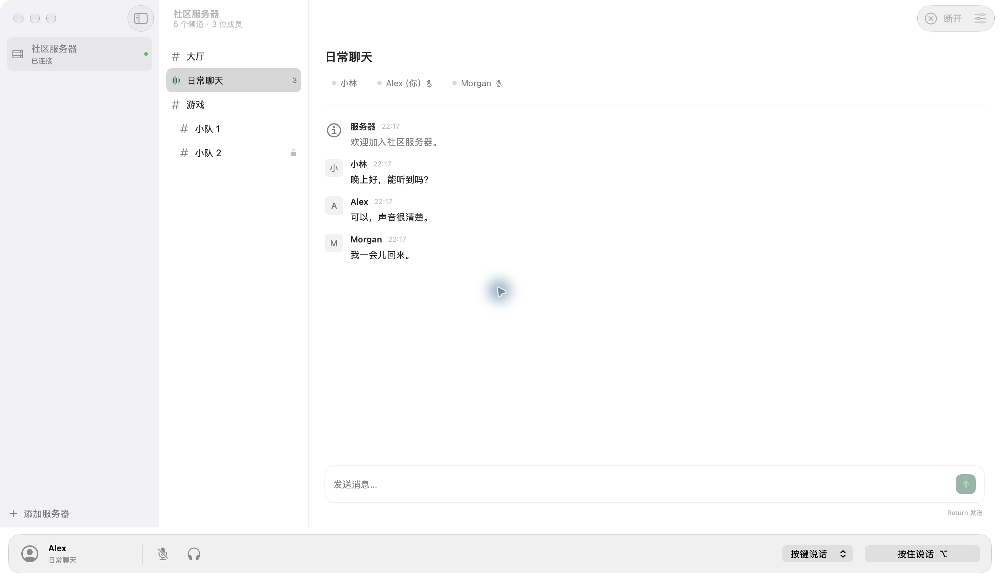

<div align="center">


# 轻语 QuietSpeak

**原生 macOS · TeamSpeak 3 · 轻量语音聊天**

连接你的 TeamSpeak 3 服务器，浏览频道、语音交流和发送消息。

[](#快速开始) [](Native/) [](Core/) [](LICENSE) [](https://github.com/Green-hats/QuietSpeak/releases/latest) [](https://github.com/Green-hats/QuietSpeak/actions/workflows/ci.yml)

[**简体中文**](README.md) · [English](README.en.md)

[快速开始](#快速开始) · [核心特性](#核心特性) · [架构设计](Docs/ARCHITECTURE.md) · [开发与贡献](CONTRIBUTING.md) · [问题反馈](https://github.com/Green-hats/QuietSpeak/issues)

</div>

---

## 界面预览



实际原生窗口，使用虚构的服务器、成员和聊天数据。

## 核心特性

| 能力 | 说明 |
| --- | --- |
| 原生界面 | SwiftUI / AppKit 三栏、可折叠侧栏、深色外观；新系统使用 Liquid Glass，旧系统使用 Material |
| 服务器与频道 | TS3 连接、SRV / TSDNS 发现、自动重连、收藏、频道树与密码频道 |
| 语音交流 | Opus 语音收发、多人混音、按键 / 持续说话、麦克风关闭、耳机静音与播放音量 |
| 文字消息 | 频道消息收发，接收服务器消息及私信 |
| macOS 集成 | 菜单栏控制、扬声器测试；收藏存入 UserDefaults，身份和记住的密码存入钥匙串 |

当前版本 **0.1.7**，界面为简体中文。[发行说明与校验文件](https://github.com/Green-hats/QuietSpeak/releases/tag/v0.1.7)。

## 快速开始

下载安装包：[Apple Silicon](https://github.com/Green-hats/QuietSpeak/releases/download/v0.1.7/QuietSpeak-0.1.7-macOS-arm64.zip) · [Intel](https://github.com/Green-hats/QuietSpeak/releases/download/v0.1.7/QuietSpeak-0.1.7-macOS-x86_64.zip)。解压后将 `QuietSpeak.app` 放入“应用程序”并打开；运行需要 macOS 14+。

自行构建还需 Xcode Command Line Tools（包含 `swift-format`）、Rust、CMake 和 Python 3.9+。推荐 Xcode 26+ 以包含 Liquid Glass；Rust 1.95.0 由 `rust-toolchain.toml` 固定。

```bash
git clone https://github.com/Green-hats/QuietSpeak.git
cd QuietSpeak
./build.sh
open dist/QuietSpeak.app
```

首次构建会下载 Rust 工具链和 Cargo 依赖；第三方源码已附带，无需子模块。脚本按当前 Mac 架构构建并进行 ad-hoc 签名，运行 App 无需 Rust 或 Homebrew。目前尚未进行 Developer ID 签名和公证。

1. 添加服务器地址、昵称和可选密码，连接后加入频道。
2. 麦克风默认关闭，点击开启并授予 macOS 麦克风权限。
3. 按住底部按钮或 `⌥ Option` 说话；键盘按键仅在 App 位于前台时生效，也可切换为持续说话。

系统侧栏按钮控制服务器栏，`⌘⇧2` 控制频道列表；分隔线可调整宽度。切换频道会关闭麦克风，耳机静音会停止发送语音。关闭窗口后仍保留菜单栏控制。

## 开发

```bash
./check.sh
./test.sh
./build.sh
```

构建缓存位于 `work/build/`，App 位于 `dist/QuietSpeak.app`。开发、验证和打包流程见 [贡献指南](CONTRIBUTING.md)，版本变化见 [CHANGELOG](CHANGELOG.md)。

Swift 管理原生界面，Rust / Tokio 处理协议与音频，通过 C ABI 交换命令和事件；Opus 静态链接到 App。完整架构和音频链路见 [架构文档](Docs/ARCHITECTURE.md)。

## 限制与排查

- 语音仅支持 OpusVoice / OpusMusic；暂无全局按键说话、语音激活、回声消除、私信发送、文件传输、权限管理和身份导入。
- 使用系统默认音频设备；切换设备后如无声音，请重新连接。
- Apple Silicon 已通过本机验证，Intel、更多 macOS 版本和双端语音仍需进一步验收。

听不到声音时，检查耳机静音与播放音量，使用语音设置中的“测试扬声器”，再检查系统输出设备。`No route to host` 通常需检查网络和代理；SRV 域名不应手动追加默认端口。

## 贡献与许可

欢迎提交 [Issue](https://github.com/Green-hats/QuietSpeak/issues) 或 PR；安全问题请按 [安全政策](SECURITY.md) 私下报告。

自有代码采用 [MIT 许可证](LICENSE)。TS3 协议基于 [ReSpeak/tsclientlib](https://github.com/ReSpeak/tsclientlib)，音频使用 CPAL、Opus / audiopus；原生界面、业务逻辑、桥接和设备音频链路由 QuietSpeak 实现。

第三方来源及补丁见 [Vendor](Vendor/README.md)，完整许可见 [第三方声明](THIRD_PARTY_NOTICES.txt)。QuietSpeak 与 TeamSpeak 官方产品无隶属关系。
