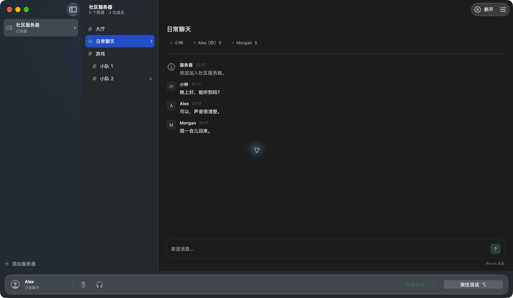
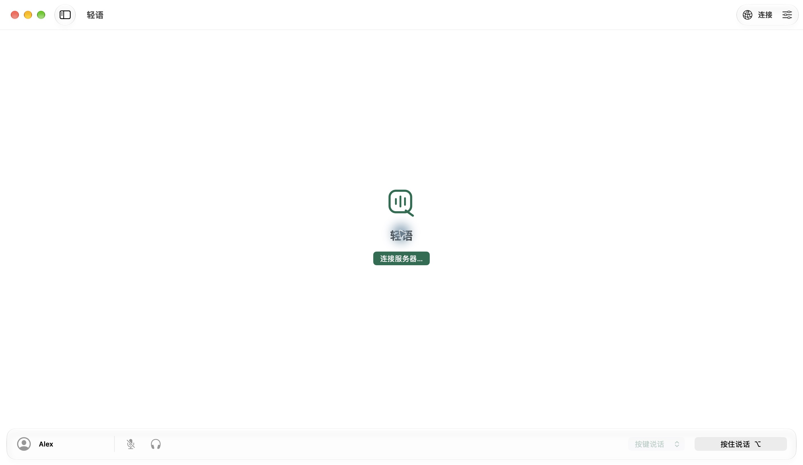
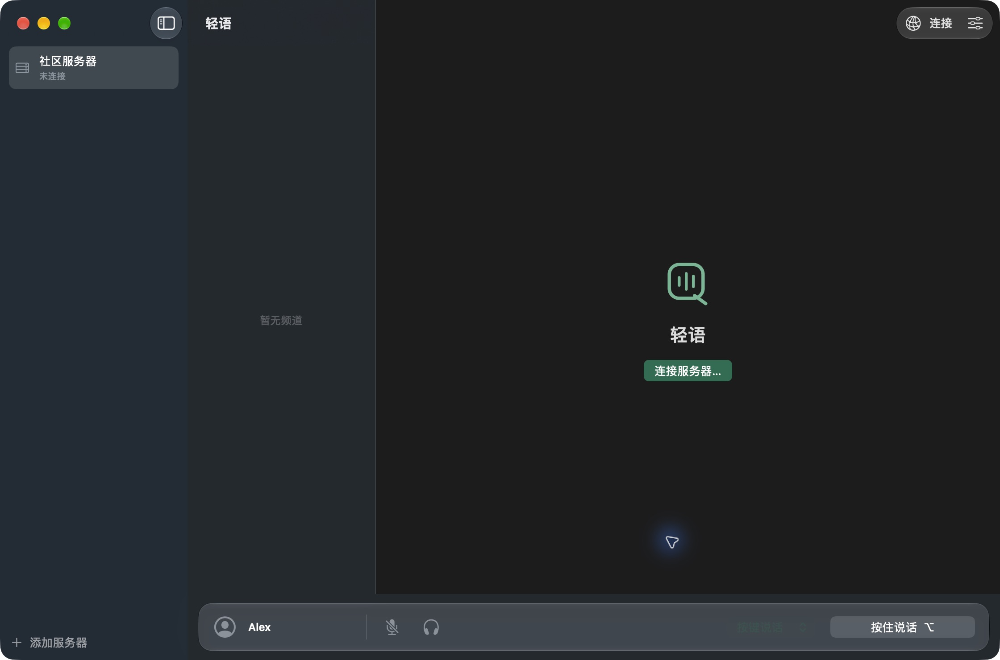
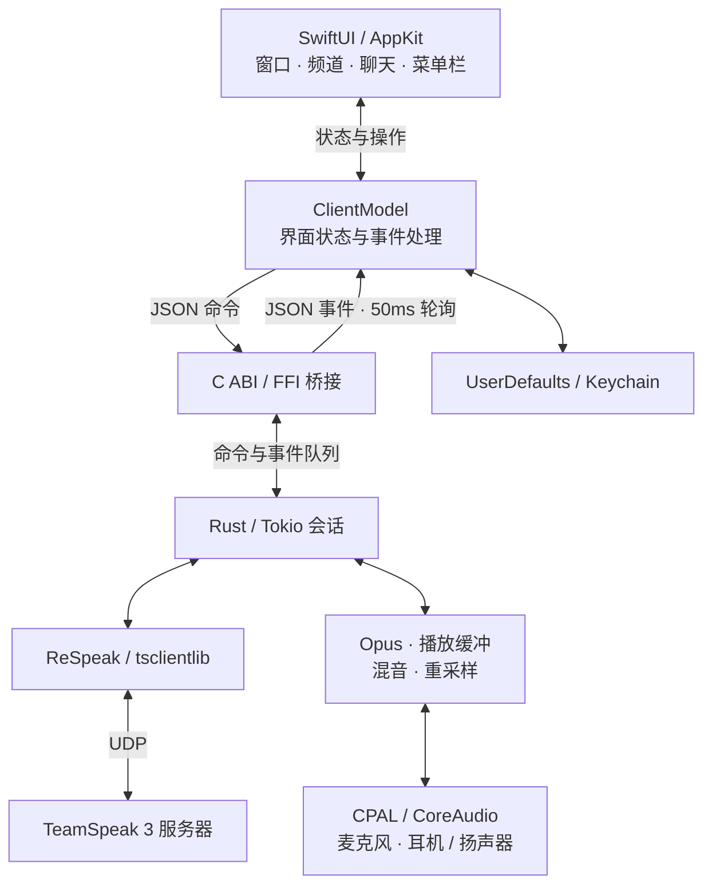

<div align="center">


# 轻语 QuietSpeak

**原生 macOS · TeamSpeak 3 · 轻量语音聊天**

连接你的 TeamSpeak 3 服务器，在原生三栏界面中浏览频道、语音交流和发送消息。

[](#快速开始) [](Native/) [](Core/) [](LICENSE) [](CHANGELOG.md) [](https://github.com/Green-hats/QuietSpeak/actions/workflows/ci.yml)

[**简体中文**](README.md) · [English](README.en.md)

[快速开始](#快速开始) · [核心特性](#核心特性) · [架构设计](#架构设计) · [文档](#文档) · [问题反馈](https://github.com/Green-hats/QuietSpeak/issues)

</div>

---

## 界面预览

| 浅色外观 | 深色外观 |
| :---: | :---: |
|  |  |

| 首页 · 浅色 | 首页 · 深色 |
| :---: | :---: |
|  |  |

截图来自实际原生窗口，使用虚构的服务器、成员和聊天数据。

## 核心特性

| 能力 | 说明 |
| --- | --- |
| 原生界面 | SwiftUI / AppKit 三栏界面，系统工具栏与可折叠、可调整宽度的侧栏 |
| 系统材质 | 白色主调、绿色点缀，适配深色外观；macOS 26+ 使用 Liquid Glass，旧系统使用 Material 毛玻璃 |
| 服务器连接 | 直接连接 TS3 服务器，支持 SRV / TSDNS 发现、固定身份和自动重连 |
| 频道浏览 | 频道树、密码频道、可见成员列表和服务器收藏 |
| 语音交流 | OpusVoice / OpusMusic 收发、多人混音、播放缓冲与重采样 |
| 语音控制 | 麦克风关闭、耳机静音、按键 / 持续说话、播放音量与本地扬声器测试 |
| 文字消息 | 发送和接收频道消息，接收服务器消息及私信 |
| macOS 集成 | 菜单栏控制，UserDefaults 保存收藏，登录钥匙串保存身份密钥和记住的密码 |

当前版本为 **0.1.7 开发预览**，界面为简体中文。目前公开源码，安装包 Release 保留为草稿，可自行构建使用。

## 快速开始

### 环境要求

| 工具 | 要求 |
| --- | --- |
| macOS | 14 或以上 |
| Xcode | 推荐 26 或以上，并选中其 Command Line Tools；工具链需包含 `swift-format` |
| Rust | `rust-toolchain.toml` 固定为 1.95.0，包含 rustfmt / clippy |
| CMake | 构建静态链接的 Opus |
| Python | 3.9 或以上 |

较旧的 Xcode 工具链可以构建 Material 外观，但不包含 Liquid Glass API。Apple Silicon 已通过本机构建和使用验证；CI 配置 Apple Silicon / Intel 两种架构，Intel 实机表现仍需验收。

### 构建与运行

```bash
git clone https://github.com/Green-hats/QuietSpeak.git
cd QuietSpeak

./build.sh
open dist/QuietSpeak.app
```

首次构建需要下载固定的 Rust 工具链和 Cargo 依赖。第三方协议库与 Opus 源码随仓库附带，无需初始化子模块。

脚本按当前 Mac 架构构建，输出 `dist/QuietSpeak.app`，完成本机 ad-hoc 签名与校验。运行 App 无需安装 Rust、Homebrew 或 Opus；当前尚未进行 Developer ID 签名和公证。

### 开始使用

1. 添加服务器地址、昵称和可选密码，连接后加入频道；密码频道会单独询问密码。
2. 麦克风默认关闭，点击开启并授予 macOS 麦克风权限。
3. 默认按键说话：按住底部按钮或 `⌥ Option`。键盘按键仅在轻语位于前台时生效；使用其他 App 时可切换为持续说话。
4. 在语音设置中调整播放音量、查看输出设备，或使用“测试扬声器”检查输出。

切换频道会自动关闭麦克风；耳机静音也会停止发送语音。关闭窗口后仍保留菜单栏控制，选择“退出轻语”才会退出。

### 界面操作

| 操作 | 方式 |
| --- | --- |
| 显示 / 隐藏服务器栏 | 系统工具栏的侧栏按钮 |
| 显示 / 隐藏频道列表 | “显示 → 显示频道列表”，或 `⌘⇧2` |
| 调整分栏宽度 | 拖动系统分隔线 |
| 连接服务器 | 右上角“连接”，或 `⌘K` |
| 语音设置 | 右上角设置按钮，或 `⌘,` |

分栏显示状态会在退出后保留。底部语音条只横跨频道和聊天区，随右侧工作区调整宽度，窄窗口自动使用紧凑控件。

## 架构设计



Swift 管理界面和用户操作，Rust 处理协议与音频。所有组件运行在一个 App 进程中，Rust 核心和 Opus 静态链接到 App，PCM 音频在 Rust 内处理。

TS3 协议基于 [ReSpeak/tsclientlib](https://github.com/ReSpeak/tsclientlib)；原生界面、业务逻辑、Swift / Rust 桥接和设备音频链路由 QuietSpeak 实现。

| 层 | 技术 |
| --- | --- |
| 界面与系统集成 | SwiftUI · AppKit · AVFoundation |
| 通信核心 | Rust · Tokio · ReSpeak/tsclientlib |
| 音频 | CPAL / CoreAudio · Opus / audiopus |
| 跨语言桥接 | C ABI · JSON 命令与事件 |
| 本地存储 | UserDefaults · macOS Keychain |
| 构建与质量 | Cargo · Xcode · CMake · Python · GitHub Actions |

完整的线程边界、FFI 所有权和音频链路见 [架构文档](Docs/ARCHITECTURE.md)。

## 项目结构

```text
QuietSpeak/
├── Native/                   # SwiftUI / AppKit、状态模型、存储与共享图标
├── Core/
│   ├── src/lib.rs            # TS3 会话、命令、事件与 FFI
│   ├── src/audio.rs          # 音频输入输出、混音与重采样
│   ├── src/chat.rs           # 聊天确认、回显处理与回归测试
│   └── examples/smoke.rs     # 保持输入静音的联机检查
├── Vendor/                   # 固定上游源码、许可证与本地补丁
├── Resources/                # App 配置与麦克风权限
├── Scripts/                  # 图标生成、版本校验、依赖声明与打包
├── Tests/                    # Swift 模型检查
├── Docs/                     # 架构、截图、路线与发布指南
├── .github/                  # 双架构 CI、Release 草稿与协作模板
├── build.sh / check.sh / test.sh
├── dist/                     # 本地生成的 App 和安装包（不入库）
└── work/                     # 构建缓存（不入库）
```

## 开发与验证

```bash
./check.sh                    # 格式、Clippy、脚本语法与版本校验
./test.sh                     # Rust 测试与 Swift 模型检查
./build.sh                    # 构建、签名和 App 校验
python3 Scripts/package-release.py
```

打包输出 App ZIP、源码 ZIP 和 SHA-256 校验文件到 `dist/releases/`。构建路径可通过 `QUIETSPEAK_BUILD_DIR`、`QUIETSPEAK_APP_PATH`、`CARGO_HOME` 和 `CARGO_TARGET_DIR` 覆盖。

本地已通过 15 项 Rust 测试和 Swift 模型检查，覆盖音频帧、编解码、包排序、重采样、聊天回显、地址校验和频道排序。测试默认不连接公共服务器、不打开真实麦克风。双端语音、蓝牙设备、Intel 与更多 macOS 版本仍需手动验收；详见 [验证记录](VALIDATION.txt) 和 [CI 构建](https://github.com/Green-hats/QuietSpeak/actions)。

发布流程见 [发布指南](Docs/RELEASING.md)：版本标签触发双架构构建并准备 Release 草稿，由维护者核对后手动发布。

## 当前限制与排查

- 语音仅支持 OpusVoice / OpusMusic，不支持 Speex / CELT。
- 暂无全局按键说话、语音激活、回声消除、私信发送、文件传输、权限管理和身份导入。
- 使用系统默认音频设备；切换蓝牙或其他设备后如无声音，请重新连接。

**听不到声音：** 确认耳机静音关闭、播放音量大于零，运行“测试扬声器”，并检查“系统设置 → 声音”的输出设备。

**提示 `No route to host`：** 检查网络和代理环境。使用 SRV 域名时不要手动追加默认端口，让客户端发现服务器端口。

## 文档

| 文档 | 内容 |
| --- | --- |
| [架构设计](Docs/ARCHITECTURE.md) | 线程、FFI、消息队列与音频数据流 |
| [开发路线](Docs/ROADMAP.md) | 当前待验收项和后续计划 |
| [贡献指南](CONTRIBUTING.md) | 开发环境、检查与提交规范 |
| [发布指南](Docs/RELEASING.md) | 打包、签名与 Release 草稿流程 |
| [更新记录](CHANGELOG.md) | 各版本的功能与修复 |
| [验证记录](VALIDATION.txt) | 自动测试及实机验证范围 |
| [第三方来源](Vendor/README.md) | 固定上游修订和本地补丁 |
| [安全政策](SECURITY.md) | 安全问题反馈方式 |

## 贡献

欢迎通过 [Issue](https://github.com/Green-hats/QuietSpeak/issues) 反馈问题或提交 PR。音频问题请附上 macOS 版本、芯片架构、音频设备和频道编码；提交代码前请阅读 [贡献指南](CONTRIBUTING.md)。

## 许可与致谢

QuietSpeak 自有代码采用 [MIT 许可证](LICENSE)，第三方代码保留各自许可证。

- [ReSpeak/tsclientlib](https://github.com/ReSpeak/tsclientlib) — TeamSpeak 3 协议实现与接收音频处理。
- [CPAL](https://github.com/RustAudio/cpal) — 跨平台音频设备接口。
- [Opus](https://opus-codec.org/) / [audiopus](https://github.com/Lakelezz/audiopus) — 语音编解码及 Rust 绑定。

固定上游来源、音频队列和构建兼容补丁见 [Vendor 文档](Vendor/README.md)；完整许可和依赖清单见 [第三方声明](THIRD_PARTY_NOTICES.txt) 与 [DEPENDENCIES.json](Docs/DEPENDENCIES.json)。

QuietSpeak 是独立客户端，与 TeamSpeak 官方产品无隶属关系。
